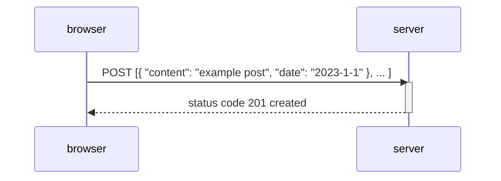

```mermaid
sequenceDiagram
    participant browser
    participant server

    browser->>server: POST [{ "content": "example post", "date": "2023-1-1" }, ... ]
    activate server
    server-->>browser: status code 201 created
    deactivate server
```